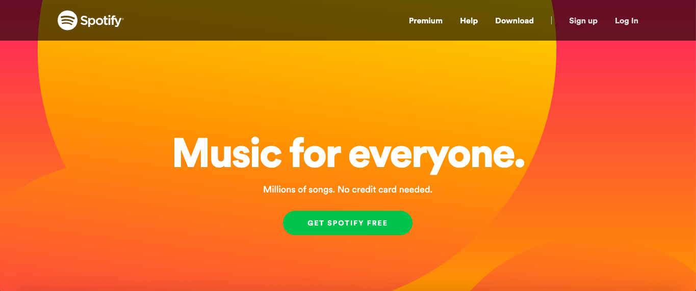

# Spotify Materialize Lab
## The Goal
Once you know how to use Materialize's components, creating professional web interfaces is possible in a much shorter amount of time. Your job in this lab is to implement and modify Materialize components to recreate the website of one of the most popular applications -- Spotify. You may already have completed the footer (it's okay if you haven't!) and now it's time to put the whole page together following the steps below. You can see the completed version at [spotify.com](https://www.spotify.com/us/). Make sure you're logged out, otherwise your screen will look different! Please note that none of the pieces you build need to work just yet -- links can be broken, etc. We're just trying to recreate the look of the home page. 
## The Lab

1. You'll start in the index.html file of this repo. Materialize has already been linked for you! The first thing we need to do is add a nav. Head to materializecss.com and look in the "Components" section for a simple Navbar. The "Right Aligned Links" one looks the closest to Spotify's. Copy paste that code into the body of your index. 
2. The navbar looks a little like Spotify's but it's missing some things. Modify the HTML so that the navbar contains all of the words seen in Spotify's navbar. Then use Materialize's color section and your knowledge of CSS to make the colorscheme, font, etc. match as closely as you can to Spotify's. 
3. Use Materialize's buttons plus your own HTML and CSS to recreate the middle portion of Spotify's page. You can find the background image used [here](https://www.scdn.co/i/home/hero-burst.svg). 
4. Help Spotify improve! Head to the Javascript section of MaterializeCSS and choose one JavaScript component to add to Spotify's page. We recommend checking out modals, parallax dropdowns, or carousels.
